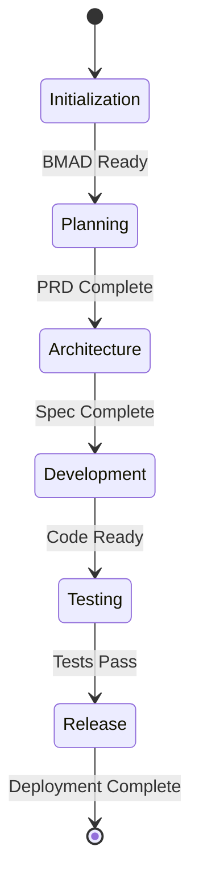

# BMAD Handover Protocol - AION

## Current State
**Phase**: RELEASE
**Active Agent**: RELEASE
**Status**: Autonomous operation active

## Handover History
| Date | From | To | Artifacts | Notes |
|------|------|----|-----------|-------|
| Unknown | From | To | Artifacts | Notes |
| Unknown | ------ | ---- | ----------- | ------- |
| Unknown | From | To | Artifacts | Notes |
| Unknown | ------ | ---- | ----------- | ------- |
| Unknown | INIT | PM | PRD |  |
| Unknown | PM | ARCHITECT | TECH_SPEC |  |
| Unknown | ARCHITECT | DEVELOPER | IMPLEMENTATION |  |
| Unknown | DEVELOPER | QA | TEST_RESULTS |  |
| Unknown | QA | RELEASE | RELEASE |  |
| Unknown | INIT | PM | PRD |  |
| Unknown | PM | ARCHITECT | TECH_SPEC |  |
| Unknown | ARCHITECT | DEVELOPER | IMPLEMENTATION |  |
| Unknown | DEVELOPER | QA | TEST_RESULTS |  |
| Unknown | QA | RELEASE | RELEASE |  |
| 2025-11-30 | INIT | PM | PRD |  |
| 2025-11-30 | PM | ARCHITECT | TECH_SPEC |  |
| 2025-11-30 | ARCHITECT | DEVELOPER | IMPLEMENTATION |  |
| 2025-11-30 | DEVELOPER | QA | TEST_RESULTS |  |
| 2025-11-30 | QA | RELEASE | RELEASE |  |

## State Flow

## Active Context
- **Goal**: Execute autonomous development lifecycle
- **Current Focus**: RELEASE operations
- **Blockers**: None

## Metrics
- **Handover Count**: 19
- **Current State**: RELEASE
- **Last Activity**: 2025-11-30T01:49:51.518Z
- **Error Rate**: 0%
