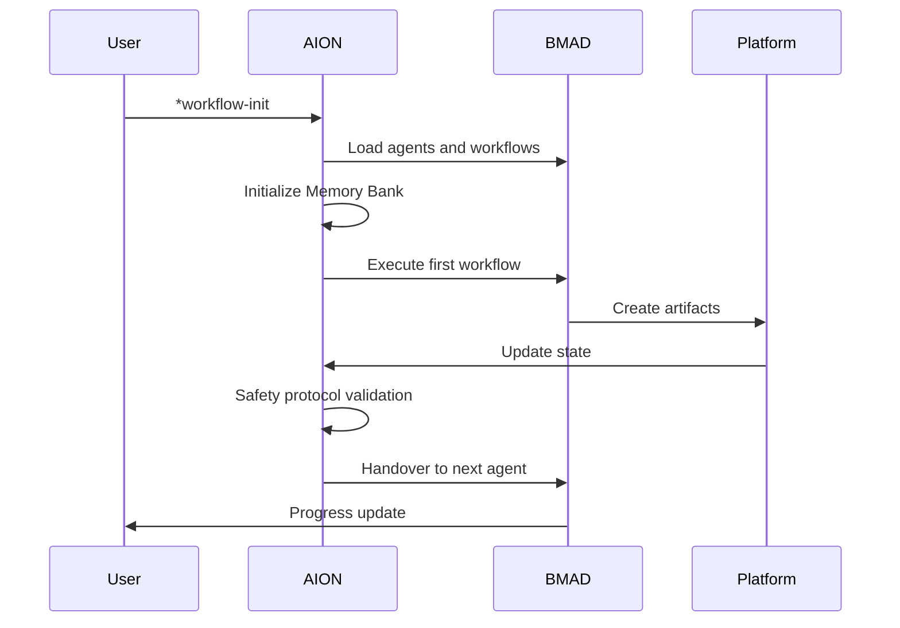
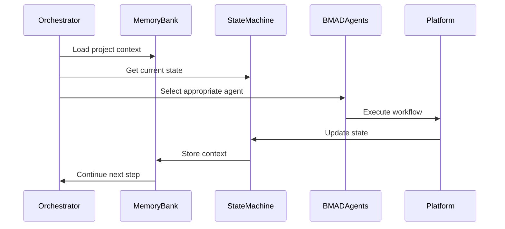

# AION Technical Architecture

## 🏗️ Overview

AION implements a **three-layer architecture** that combines BMAD-METHOD's robust infrastructure with BMAD-GITHUB-NATIVE-FULL-CYCLE's orchestration philosophy.

```
┌─────────────────────────────────────────────────────────────┐
│                    LAYER 3: Platform Integration              │
│  ┌─────────────┐ ┌─────────────┐ ┌─────────────┐ ┌─────────┐ │
│  │   GitHub    │ │   GitLab    │ │ Azure DevOps │ │  Others │ │
│  │   Native    │ │   Native    │ │   Native    │ │         │ │
│  └─────────────┘ └─────────────┘ └─────────────┘ └─────────┘ │
└─────────────────────────────────────────────────────────────┘
                                │
┌─────────────────────────────────────────────────────────────┐
│                   LAYER 2: AION Orchestration                │
│  ┌─────────────┐ ┌─────────────┐ ┌─────────────┐ ┌─────────┐ │
│  │ Memory Bank │ │ State       │ │ Safety      │ │ Workflow│ │
│  │ System      │ │ Machine     │ │ Protocol    │ │ Engine  │ │
│  └─────────────┘ └─────────────┘ └─────────────┘ └─────────┘ │
└─────────────────────────────────────────────────────────────┘
                                │
┌─────────────────────────────────────────────────────────────┐
│                    LAYER 1: BMAD Foundation                  │
│  ┌─────────────┐ ┌─────────────┐ ┌─────────────┐ ┌─────────┐ │
│  │ BMad Core   │ │ BMM Module  │ │ BMB Module  │ │ CIS     │ │
│  │ Framework   │ │ (Development│ │ (Builder)   │ │ (Creative│ │
│  │             │ │ Workflows)  │ │             │ │ Suite)  │ │
│  └─────────────┘ └─────────────┘ └─────────────┘ └─────────┘ │
└─────────────────────────────────────────────────────────────┘
```

---

## 🎯 Layer 1: BMAD Foundation

### Core Components
```javascript
// BMad Core Framework
src/core/
├── agents/           # Base agent framework
├── workflows/        # Workflow engine
├── tasks/           # Atomic operations
├── tools/           # Utility functions
└── resources/        # Shared resources

// BMAD Modules
src/modules/
├── bmm/             # BMad Method (19 agents, 50+ workflows)
├── bmb/             # BMad Builder (agent creation)
├── cis/             # Creative Intelligence Suite
└── aion/            # AION Orchestration (NEW)
```

### Key Features
- **BMad Core**: Universal collaboration engine
- **19 Specialized Agents**: Deep domain expertise
- **50+ Workflows**: Complete development lifecycle
- **Schema Validation**: Automated quality assurance
- **CLI Tools**: Complete management system

### Integration Points
```javascript
// AION extends BMAD Core
class AIONCore extends BMadCore {
  constructor() {
    super();
    this.memoryBank = new MemoryBank();
    this.stateMachine = new StateMachine();
    this.safetyProtocol = new SafetyProtocol();
  }
}
```

---

## 🔄 Layer 2: AION Orchestration

### Core Components

#### Memory Bank System
```javascript
class MemoryBank {
  constructor() {
    this.productContext = new ProductContext();
    this.activeContext = new ActiveContext();
    this.contextManager = new BMADContextManager();
  }
  
  // Persistent context management
  updateContext(persona, artifacts) {
    this.activeContext.update(persona, artifacts);
    this.productContext.merge(artifacts);
    this.contextManager.sync();
  }
}
```

#### State Machine
```javascript
class StateMachine {
  constructor() {
    this.currentState = 'INIT';
    this.handoverLog = new HandoverLog();
    this.transitionRules = new TransitionRules();
  }
  
  // Automated handover between personas
  handover(fromPersona, toPersona, artifacts) {
    this.validateTransition(fromPersona, toPersona);
    this.executeHandover(fromPersona, toPersona, artifacts);
    this.updateState(toPersona);
  }
}
```

#### Safety Protocol
```javascript
class SafetyProtocol {
  constructor() {
    this.commitTracker = new CommitTracker();
    this.rollbackManager = new RollbackManager();
    this.validationGates = new BMADValidationGates();
  }
  
  // Micro-commit with validation
  microCommit(persona, stepId, description, changes) {
    this.validationGates.validate(changes);
    const commit = this.createCommit(persona, stepId, description, changes);
    this.commitTracker.track(commit);
    return commit.id;
  }
}
```

#### Workflow Engine
```javascript
class WorkflowEngine {
  constructor() {
    this.bmmWorkflows = new BMMWorkflows();
    this.aionWorkflows = new AIONWorkflows();
    this.orchestrator = new Orchestrator();
  }
  
  // Execute autonomous workflow
  async executeWorkflow(workflowId, context) {
    const workflow = this.getWorkflow(workflowId);
    return this.orchestrator.execute(workflow, context);
  }
}
```

---

## 🌐 Layer 3: Platform Integration

### GitHub Native Integration
```javascript
class GitHubIntegration {
  constructor() {
    this.api = new GitHubAPI();
    this.workflowMapper = new WorkflowMapper();
    this.automationEngine = new AutomationEngine();
  }
  
  // Map BMAD workflows to GitHub features
  mapWorkflows() {
    return {
      'planning-prd': this.api.issues.createWithTemplate,
      'architecture-design': this.api.wiki.create,
      'implementation': this.api.pulls.createWithReview,
      'testing': this.api.actions.runWorkflow,
      'release': this.api.releases.createWithAssets
    };
  }
}
```

### Multi-Platform Abstraction
```javascript
class PlatformAdapter {
  constructor(platform) {
    this.platform = platform;
    this.adapter = this.getAdapter(platform);
  }
  
  getAdapter(platform) {
    switch(platform) {
      case 'github': return new GitHubAdapter();
      case 'gitlab': return new GitLabAdapter();
      case 'azure': return new AzureDevOpsAdapter();
      default: return new GenericAdapter();
    }
  }
}
```

---

## 🔄 Data Flow Architecture

### Request Flow


### Autonomous Operation Flow


---

## 🗂️ File Structure

```
aion/
├── src/
│   ├── core/                    # BMad Core (inherited)
│   │   ├── agents/             # Base agent framework
│   │   ├── workflows/          # Workflow engine
│   │   ├── tasks/              # Atomic operations
│   │   └── tools/              # Utilities
│   ├── modules/
│   │   ├── bmm/                # BMad Method (inherited)
│   │   │   ├── agents/         # 19 specialized agents
│   │   │   ├── workflows/      # 50+ workflows
│   │   │   └── teams/          # Agent teams
│   │   ├── bmb/                # BMad Builder (inherited)
│   │   ├── cis/                # Creative Suite (inherited)
│   │   └── aion/               # AION Orchestration (NEW)
│   │       ├── agents/         # AION-enhanced agents
│   │       ├── workflows/      # AION-specific workflows
│   │       ├── memory/         # Memory Bank system
│   │       ├── state/          # State machine
│   │       ├── safety/         # Safety protocol
│   │       └── platform/       # Platform integration
│   └── utility/                # Shared utilities
├── tools/
│   ├── cli/                    # BMAD CLI (extended)
│   │   ├── commands/           # CLI commands
│   │   └── installers/         # Installation tools
│   ├── aion/                   # AION-specific tools
│   │   ├── memory-manager.js   # Memory Bank CLI
│   │   ├── state-manager.js    # State machine CLI
│   │   └── platform-cli.js     # Platform management
│   └── validation/              # Quality gates
├── docs/                       # Documentation
├── tests/                      # Test suites
├── productContext.md           # Memory Bank (persistent)
├── activeContext.md            # Memory Bank (session)
└── .github/
    ├── BMAD_HANDOVER.md        # State tracking
    └── workflows/              # Platform workflows
```

---

## 🔧 Component Interactions

### Agent Coordination
```javascript
class AgentCoordinator {
  constructor() {
    this.agents = bmm.getAllAgents();
    this.stateMachine = new StateMachine();
    this.memoryBank = new MemoryBank();
  }
  
  async coordinateWorkflow(workflowId) {
    const workflow = this.getWorkflow(workflowId);
    const context = this.memoryBank.getContext();
    
    for (const step of workflow.steps) {
      const agent = this.agents.get(step.agent);
      const result = await agent.execute(step.task, context);
      
      // Safety protocol
      this.safetyProtocol.microCommit(step.agent, step.id, step.description, result);
      
      // Update memory
      this.memoryBank.updateContext(step.agent, result);
      
      // State transition
      if (step.nextAgent) {
        this.stateMachine.handover(step.agent, step.nextAgent, result);
      }
    }
  }
}
```

### Memory Management
```javascript
class MemoryManager {
  constructor() {
    this.productContext = new ProductContext('productContext.md');
    this.activeContext = new ActiveContext('activeContext.md');
    this.bmmSharding = new BMADSharding();
  }
  
  async updateContext(persona, artifacts) {
    // Use BMAD's document sharding for efficiency
    const shardedArtifacts = this.bmmSharding.process(artifacts);
    
    // Update active context
    this.activeContext.update(persona, shardedArtifacts);
    
    // Merge into product context
    this.productContext.merge(shardedArtifacts);
    
    // Sync with BMAD context manager
    await this.bmmContextManager.sync();
  }
}
```

---

## 🎯 Performance Considerations

### Optimization Strategies
1. **BMAD Document Sharding**: 90% token savings for large projects
2. **Lazy Loading**: Load agents and workflows on demand
3. **Caching**: Cache frequently used contexts and states
4. **Parallel Execution**: Run independent tasks in parallel
5. **Resource Pooling**: Reuse agent instances across workflows

### Monitoring and Metrics
```javascript
class PerformanceMonitor {
  constructor() {
    this.metrics = new BMADMetrics();
    this.profiler = new Profiler();
  }
  
  trackWorkflow(workflowId, execution) {
    const metrics = {
      duration: this.profiler.duration(execution),
      tokenUsage: this.profiler.tokenUsage(execution),
      agentPerformance: this.profiler.agentPerformance(execution),
      platformCalls: this.profiler.platformCalls(execution)
    };
    
    this.metrics.record(workflowId, metrics);
  }
}
```

---

## 🔒 Security Architecture

### Security Layers
1. **BMAD Validation**: Schema validation and type checking
2. **Input Sanitization**: Clean all inputs before processing
3. **Access Control**: Role-based permissions for agents
4. **Audit Trail**: Complete logging of all operations
5. **Secret Management**: Secure handling of API keys and tokens

### Security Implementation
```javascript
class SecurityManager {
  constructor() {
    this.bmadValidation = new BMADValidation();
    this.accessControl = new AccessControl();
    this.auditLogger = new AuditLogger();
  }
  
  async secureExecution(agent, task, context) {
    // Validate inputs
    await this.bmadValidation.validate(task);
    
    // Check permissions
    this.accessControl.verify(agent, task);
    
    // Log execution
    this.auditLogger.log(agent, task, context);
    
    // Execute with monitoring
    return this.monitoredExecution(agent, task, context);
  }
}
```

---

## 🎯 Architecture Benefits

### Scalability
- **Modular Design**: Easy to add new agents and workflows
- **Platform Abstraction**: Support for multiple platforms
- **Resource Management**: Efficient use of system resources
- **Load Balancing**: Distribute workload across agents

### Reliability
- **BMAD Foundation**: Battle-tested core framework
- **Safety Protocols**: Comprehensive error handling and recovery
- **State Persistence**: Survive system restarts and failures
- **Quality Gates**: Automated validation and testing

### Maintainability
- **Clear Separation**: Distinct layers with specific responsibilities
- **Standard Interfaces**: Consistent APIs across components
- **Documentation**: Comprehensive documentation and examples
- **Testing**: Complete test coverage for all components

---

*This architecture provides the foundation for a robust, scalable, and maintainable autonomous development system that combines the best of both worlds: BMAD's proven infrastructure and autonomous orchestration innovation.*