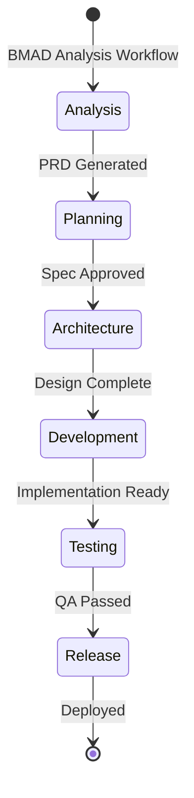

# Heritage from BMAD-GITHUB-NATIVE-FULL-CYCLE

## 🎯 Core Concepts Inherited

AION inherits the innovative autonomous orchestration philosophy from **BMAD-GITHUB-NATIVE-FULL-CYCLE**, adapting and enhancing these concepts for production readiness.

---

## 🤖 1. Autonomous Operation Philosophy

### Original Concept
> "AI agent operates continuously through specialized personas, managing the complete software development lifecycle from planning to release"

### AION Enhancement
- **Multi-Agent Coordination**: 19 BMAD agents operating autonomously
- **State Machine Coordination**: Systematic handover between personas
- **Continuous Operation**: 24/7 development without interruption
- **Self-Healing**: Automatic error detection and recovery

### Implementation in AION
```javascript
// Original: Single agent coordination
// AION: Multi-agent orchestration with BMAD framework
const aionOrchestrator = new BMADOrchestrator({
  agents: bmm.getAllAgents(), // 19 specialized agents
  coordination: stateMachine, // Handover tracking
  memory: memoryBank,         // Persistent context
  safety: microCommitProtocol // Granular rollback
});
```

---

## 🛡️ 2. Safety Protocol Evolution

### Original Concept
> "Micro-commits with indexed IDs for granular rollback"

### Original Implementation
```
[PERSONA] [STEP-XXX] Description
```

### AION Enhancement
- **Enhanced Tracking**: Integration with BMAD's validation system
- **Quality Gates**: Pre-commit validation using BMAD schemas
- **Automated Recovery**: Smart rollback with dependency analysis
- **Audit Trail**: Enhanced logging with BMAD's monitoring

### Implementation in AION
```bash
# Original: Simple micro-commit
[DEV] [STEP-042] Implement user authentication

# AION: Enhanced with BMAD validation
[DEV] [STEP-042] Implement user authentication
✅ BMAD Schema Validation: PASSED
✅ Security Scan: PASSED  
✅ Performance Check: PASSED
✅ Documentation Generated: YES
```

---

## 🧠 3. Memory Bank System Advancement

### Original Concept
> "Memory Bank system for efficient context management"

### Original Components
- **productContext.md**: Persistent project knowledge
- **activeContext.md**: Current session context
- **Hybrid RAG**: Vector search + keyword search

### AION Enhancement
- **BMAD Integration**: Leverages BMAD's document sharding (90% token savings)
- **Enhanced Search**: BMAD's semantic analysis capabilities
- **Cross-Session Learning**: Knowledge persists and improves across sessions
- **Multi-Project Memory**: Shared learning across different projects

### Implementation in AION
```javascript
// Original: Basic memory management
const memoryBank = {
  product: read('productContext.md'),
  active: read('activeContext.md')
};

// AION: Enhanced with BMAD capabilities
const aionMemoryBank = new BMADMemoryManager({
  product: bmm.documentSharder.load('productContext.md'),
  active: bmm.semanticAnalyzer.load('activeContext.md'),
  search: bmm.hybridRAG,
  optimization: bmm.tokenOptimizer
});
```

---

## 🔄 4. State Machine Orchestration

### Original Concept
> "State machine for handover and persona transitions"

### Original Implementation
- **BMAD_HANDOVER.md**: State tracking file
- **Manual Transitions**: Developer-guided handovers
- **Basic State Tracking**: Simple status updates

### AION Enhancement
- **Automated Transitions**: AI-driven handover decisions
- **BMAD Workflow Integration**: Leverages 50+ BMAD workflows
- **Advanced State Management**: Complex state graphs with dependencies
- **Predictive Handoffs**: AI anticipates next persona requirements

### Implementation in AION


---

## 🎭 5. Specialized Persona System

### Original Concept
> "8 distinct AI personas with specific responsibilities"

### Original Personas
| Persona | Domain | Output |
|---------|--------|--------|
| PM | Requirements | PRD.md |
| Architect | System Design | TECH_SPEC.md |
| Developer | Implementation | Code + Commits |
| QA | Testing | PR Reviews |
| DevOps | CI/CD | Workflows |
| Security | Security | Policies |
| Release | Deployment | Releases |

### AION Enhancement
- **19 BMAD Agents**: Expanded from 8 to 19 specialized agents
- **Enhanced Capabilities**: Each agent has BMAD's deep domain expertise
- **Cross-Domain Collaboration**: Agents coordinate across domains
- **Learning Agents**: Agents improve with each project

### Implementation in AION
```javascript
// Original: 8 basic personas
const personas = ['PM', 'Architect', 'Developer', 'QA', 'DevOps', 'Security', 'Release'];

// AION: 19 BMAD-enhanced agents
const aionAgents = {
  // Core Development (8)
  pm: bmm.agents.productManager,
  analyst: bmm.agents.analyst,
  architect: bmm.agents.architect,
  scrumMaster: bmm.agents.scrumMaster,
  developer: bmm.agents.developer,
  testArchitect: bmm.agents.testArchitect,
  uxDesigner: bmm.agents.uxDesigner,
  techWriter: bmm.agents.technicalWriter,
  
  // Game Development (3)
  gameDesigner: bmm.agents.gameDesigner,
  gameDeveloper: bmm.agents.gameDeveloper,
  gameArchitect: bmm.agents.gameArchitect,
  
  // Creative Intelligence (5)
  brainstormingCoach: cis.agents.brainstormingCoach,
  designThinkingMaestro: cis.agents.designThinkingMaestro,
  problemSolver: cis.agents.problemSolver,
  innovationOracle: cis.agents.innovationOracle,
  masterStoryteller: cis.agents.masterStoryteller,
  
  // Orchestration (1)
  bmadMaster: core.agents.bmadMaster,
  
  // Building (1)
  bmadBuilder: bmb.agents.bmadBuilder
};
```

---

## 🌐 6. GitHub Native Integration

### Original Concept
> "Leverages GitHub's native features - no external tools"

### Original Implementation
- **Basic GitHub API**: Simple issue and PR management
- **Manual Workflows**: Developer-guided GitHub operations
- **Limited Automation**: Basic CI/CD integration

### AION Enhancement
- **Advanced GitHub Integration**: Deep API utilization
- **BMAD Workflow Mapping**: BMAD workflows → GitHub features
- **Automated Operations**: Full autonomous GitHub management
- **Multi-Platform Ready**: Extensible beyond GitHub

### Implementation in AION
```javascript
// Original: Basic GitHub usage
const github = {
  createIssue: (title, description) => githubAPI.issues.create({title, description}),
  createPR: (title, description) => githubAPI.pulls.create({title, description})
};

// AION: Enhanced with BMAD workflows
const aionGitHub = new BMADGitHubIntegration({
  workflows: {
    'planning-prd': githubAPI.issues.createWithTemplate,
    'architecture-design': githubAPI.wiki.create,
    'implementation': githubAPI.pulls.createWithReview,
    'testing': githubAPI.actions.runWorkflow,
    'release': githubAPI.releases.createWithAssets
  },
  automation: {
    issueManagement: bmm.workflows.issueManagement,
    prAutomation: bmm.workflows.prAutomation,
    releaseManagement: bmm.workflows.releaseManagement
  }
});
```

---

## 📊 7. Quality and Validation

### Original Concept
> "Basic validation and testing"

### AION Enhancement
- **BMAD Quality Gates**: Schema validation, automated testing
- **Enhanced Testing**: BMAD's comprehensive test frameworks
- **Performance Monitoring**: BMAD's built-in metrics
- **Security Scanning**: BMAD's security validation

---

## 🎯 Summary of Heritage

### What AION Preserves from BMAD-GITHUB-NATIVE-FULL-CYCLE
✅ **Autonomous Operation Philosophy**  
✅ **Safety Protocol with Micro-commits**  
✅ **Memory Bank System**  
✅ **State Machine Orchestration**  
✅ **GitHub Native Integration**  
✅ **Persona-Driven Development**  

### What AION Enhances
🚀 **19 Agents vs 8 Personas**  
🚀 **BMAD Quality Gates Integration**  
🚀 **Advanced Memory Management**  
🚀 **Automated State Transitions**  
🚀 **Production-Ready Infrastructure**  
🚀 **Multi-Platform Extensibility**  

### The Perfect Fusion
**BMAD-GITHUB-NATIVE-FULL-CYCLE** provides the **innovative philosophy** and **autonomous concepts**.  
**BMAD-METHOD** provides the **robust infrastructure** and **production-tested framework**.  

**AION** combines both to create a **production-ready autonomous development system** that's both innovative and reliable.

---

*This heritage ensures AION maintains the innovative spirit of autonomous orchestration while gaining the robustness needed for production environments.*